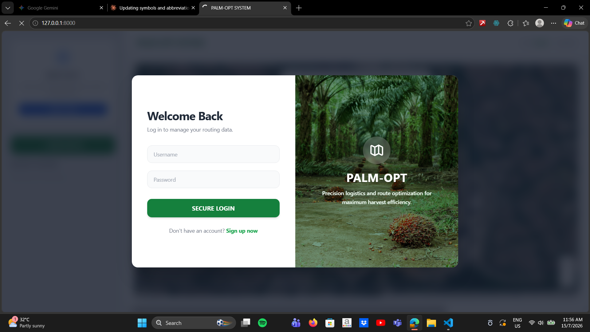
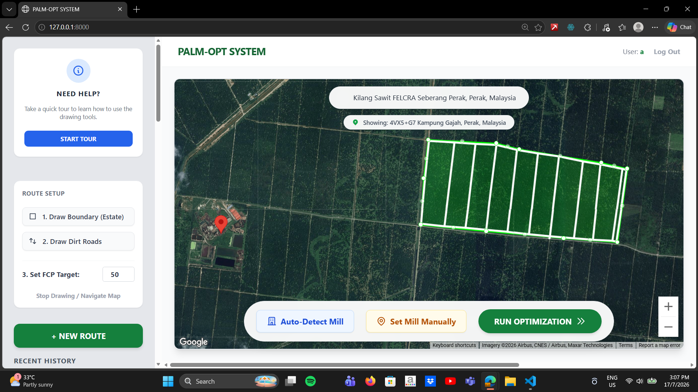
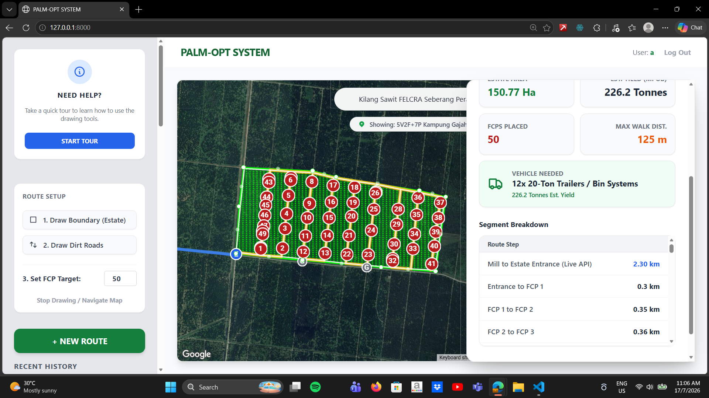
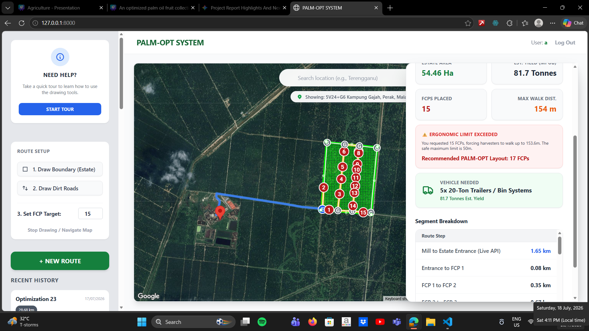

# Palm-Oil-Project

# PALM-OPT: Upstream Logistics & Route Optimization System
> **Optimizing Fresh Fruit Bunch (FFB) collection logistics in oil palm plantations using spatial clustering and hybrid metaheuristics.**

## Problem & Solution Overview
In upstream palm oil operations, inefficient Fruit Collection Point (FCP) placement and unoptimized in-field lorry navigation cause excessive fuel consumption, long turnaround times, and increased mechanical wear. 

**PALM-OPT** automates plantation logistics through an end-to-end algorithmic pipeline:
1. **FCP Spatial Placement:** Partitions plantation blocks and allocates optimal FCP positions to minimize harvester walking distance using **K-Means Clustering**.
2. **Traveling Salesperson Problem (TSP) Optimization:** Finds the optimal collection tour visiting every FCP once and returning to the entrance/mill using a **Genetic Algorithm (GA)** hybridized with local search operators (**2-Opt** and **Or-Opt**).
3. **Realistic Kinematic Modeling:** Implements **turn penalties** into the TSP objective function to penalize sharp angles and reflect actual heavy-lorry maneuverability on narrow plantation dirt tracks.

## System Workflow

| 1. Authentication & Dashboard | 2. Boundary & Road Mapping |
|:---:|:---:|
|  |  |
| *Session-based auth with historical run logs.* | *Interactive satellite estate polygon & internal road digitization.* |

| 3. Hybrid Optimization Engine | 4. Yield & Fleet Routing Report |
|:---:|:---:|
|  |  |
| *Executing K-Means clustering + GA-TSP with turn penalties.* | *Comprehensive breakdown: MPOB yield, vehicle capacity, and distances.* |

## Algorithmic Pipeline & Technical Core

* **K-Means Spatial Clustering:** Dynamically computes centroids across estate boundaries to position FCPs within predefined worker walk-distance thresholds.
* **Genetic Algorithm (GA) Global Search:** Explores permutations of FCP sequences to solve the Traveling Salesperson Problem (TSP) globally across complex dirt-road networks.
* **Hybrid Local Search (2-Opt & Or-Opt):**
  * **2-Opt:** Untangles crossing paths by reversing tour sub-segments.
  * **Or-Opt:** Relocates consecutive sequences of FCPs (1, 2, or 3 nodes) to eliminate detour loops and streamline the tour.
* **Physical Turn Penalties:** Modifies the Euclidean/graph cost matrix with angular penalties to reflect heavy haulage lorry dynamics (preventing sharp 3-point turns on unpaved roads).
* **Dual-Layer Routing:** Blends internal custom dirt-road graphs with live Google Directions API routing (Mill $\leftrightarrow$ Estate Entrance).

## Key Features

* **Satellite GIS Workspace:** Built on Google Maps API for drawing boundaries, plotting dirt tracks, and geo-locating mills.
* **Autonomous Mill Detection:** Automatically detects the nearest processing mill or accepts custom coordinate overrides.
* **MPOB-Calibrated Estimates:** Estimates yield tonnage based on estate surface area ($Ha$) and standard MPOB parameters.
* **Fleet Sizing Recommendations:** Calculates required vehicle units (e.g., 20-Ton bin systems) against generated yield loads.
* **Turn-by-Turn Leg Breakdown:** Detailed internal path length, speed, and transit time matrix.

## Tech Stack

* **Frontend:** HTML5, CSS3, JavaScript (ES6+), Google Maps JavaScript API
* **Backend / Engine:** Python (FastAPI / Flask / Django)
* **Optimization:** Custom GA, 2-Opt, Or-Opt, K-Means Clustering
